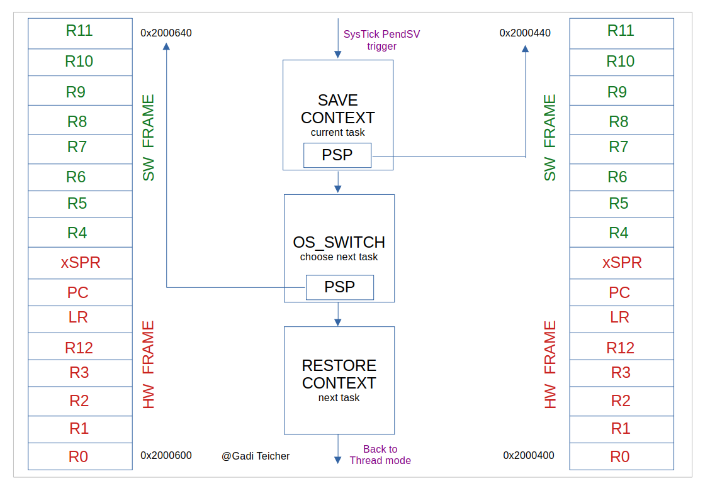
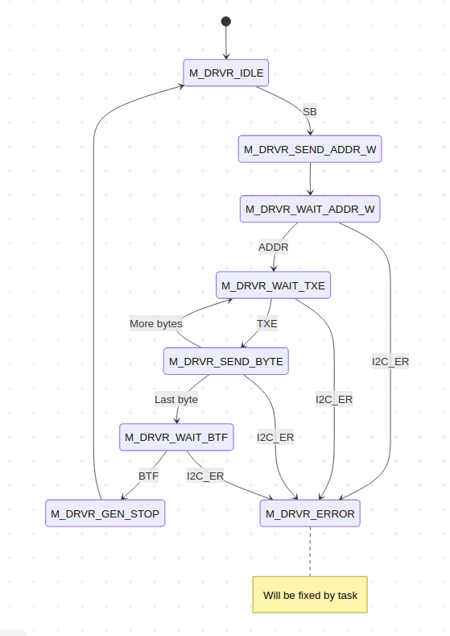

# STM32 Bare-Metal RTOS (From Scratch)

> *Context switching is an identity swap performed right under the CPU’s nose.*

## Overview

A **from-scratch bare-metal RTOS kernel** running on **STM32 NUCLEO-F446RE (Cortex-M4)**.

The project focuses on how a Cortex-M actually works: manual scheduling, context switching, stack control, and interrupt-driven execution — without FreeRTOS, CMSIS-OS, or external frameworks.

---

## Kernel Highlights

- Pure bare-metal implementation  
- Manual context switching via **PendSV**
- Explicit **PSP / MSP** separation
- Handcrafted initial stack frames (fake exception frames)
- Deterministic scheduler behavior
- Debugger-driven, hardware-first development

---

## Architecture

### RTOS Core
- TIM2 time base  
- SVC for first task start  
- PendSV context switching  
- TCB array + explicit stack management  

### Tasks
- LED task  
- Button (EXTI) task  
- **Interrupt-driven I2C Master task**
- Idle task  

---

## Context Switching Model

- Hardware stacks: **R0–R3, R12, LR, PC, xPSR**
- Software saves: **R4–R11**
- Tasks begin from a synthetic exception frame  
- PendSV runs at lowest priority

> *Context switching is a chain — if the first task is broken, the next one never starts.*

---

## Interrupt-Driven I2C Master (Write-Only, V1)

The kernel is validated using a realistic peripheral workload: an **ISR-driven I2C Master FSM**.

### Dual-FSM Structure

- **Task-level FSM**: prepares transaction (buffer + length)
- **ISR-level FSM**: advances strictly on hardware events (**SB / ADDR / TXE / BTF**)

No polling.  
No blocking delays.  
Pure interrupt choreography.

> *On microcontrollers, parallelism is an art.*

---

## Debugging Focus

- HardFault root-cause analysis  
- Stack corruption and alignment  
- Exception return edge cases  
- Safe PSP/MSP transitions under interrupt load  

The goal is not just to make it run — but to understand why it runs.

---

## Hardware

- STM32 NUCLEO-F446RE  
- TIM2 scheduler tick  
- GPIO + EXTI  
- I2C peripheral workload  

---

## Status

Actively evolving.  
Features are added only after full architectural validation.

