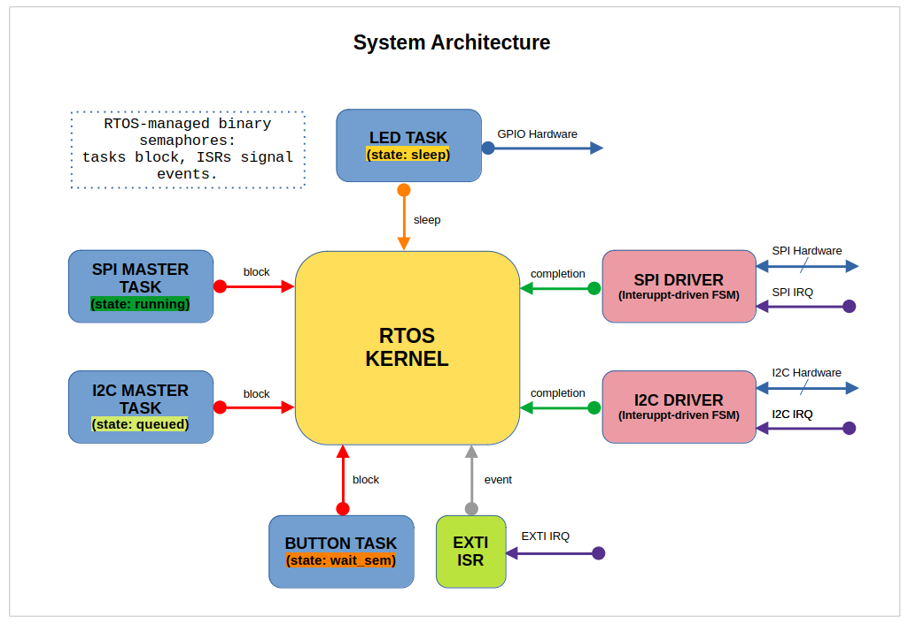
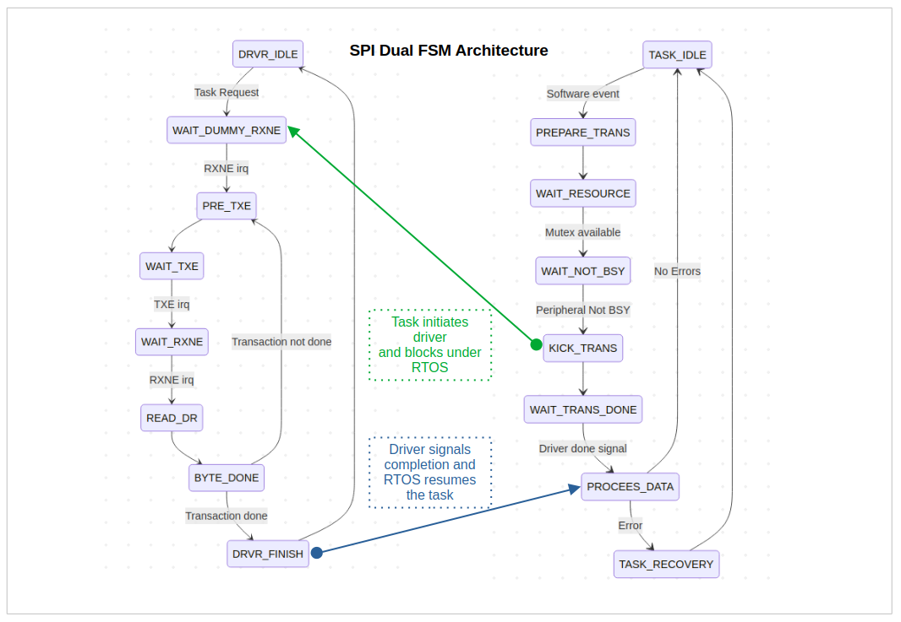

# STM32 Bare-Metal RTOS (From Scratch)

> *Context switching is an identity swap performed right under the CPU’s nose.*

## Overview

A **from-scratch bare-metal RTOS kernel** running on **STM32 NUCLEO-F446RE (Cortex-M4)**.

This project explores how a Cortex-M behaves at runtime:  
manual scheduling, context switching, stack separation, and interrupt-driven execution —  
**without FreeRTOS, CMSIS-OS, or external abstractions.**

For architecture diagrams and FSM visualizations: [Documents](Documents/).

## Key Idea

Context switching adds a new dimension to execution.

Instead of a single flat control flow, the system becomes a set of independent execution contexts.  
Each task can be written in a natural sequential style, while the runtime controls when execution moves between them.

---

### RTOS Core

- TIM2 as system tick (1 kHz time base)
- SVC used for controlled first task start
- PendSV as the only context switching mechanism
- Static TCB array with per-task stack ownership

### Tasks

- LED task (visible execution)
- Button task (EXTI-driven + debounce handling)
- **SPI task (loopback validation)**
- I2C Master task (write-only)
- Idle task (WFI-based)

---

## Context Switching

- Hardware-stacked registers: **R0–R3, R12, LR, PC, xPSR**
- Software-saved registers: **R4–R11**
- Tasks initialized via **synthetic exception frames**
- PendSV runs at lowest priority to ensure safe preemption

> *Context switching is a chain — if the first task is broken, the next one never starts.*

---

## Scheduling & Synchronization

- Priority-based preemptive scheduling  
- Fair round-robin within equal priority levels  
- Binary Semaphores used for ISR-to-task signaling and driver completion events
- Critical sections ensure safe state transitions

**Multiple lightweight stub tasks are used to validate scheduling behavior under different priorities.**

### Sleeping List (Experimental)

An alternative design was implemented using a linked list to track only sleeping tasks.  
The goal was to reduce unnecessary checks by evaluating only tasks waiting on time events.

**Expected Advantage:**
- Reduce scheduler workload from O(N) → O(K), where K is the number of sleeping tasks
- Avoid scanning active or ready tasks

### Observations

In practice, the linked-list approach introduced several performance and system-level drawbacks:

- Increased latency due to pointer traversal (pointer chasing)
- Costly insert/remove operations
- Poor cache locality (non-contiguous memory access)
- Non-deterministic timing behavior
- Overhead from dynamic memory management

For the tested system (with a small, fixed number of tasks), the overhead outweighed the theoretical benefits.

---

## Interrupt-Driven SPI (Primary Workload)

The SPI driver is implemented as an FSM driven by TXE/RXNE IRQ events.

The system is validated using a high-rate SPI loopback workload (MOSI → MISO)
to observe scheduling behavior under heavy interrupt load.

### Dual-FSM Architecture

The design separates responsibilities between two state machines:

- **Task-level FSM**  
  Defines what transaction should be executed, prepares data, initiates the transaction, and blocks under the scheduler.

- **Driver/ISR-level FSM**  
  Executes the transaction on the hardware lines, advances tx/rx, and signals task completion.

> *On microcontrollers, parallelism is an art.*

---

## Interrupt-Driven I2C Master (Write-Only)

The kernel also includes an **ISR-driven I2C Master FSM**.

- Task prepares transaction parameters
- ISR advances strictly on hardware events (**SB / ADDR / TXE / BTF**)
- Explicit error-handling path with recovery (bus errors, SW reset)

---

## Debugging & Insights

- Correct exception stack layout is mandatory for reliable context switching.
- Interrupt storms can starve the scheduler if peripheral IRQs are not tightly controlled.
- Preemption alone does not ensure fairness — tasks must yield or block to avoid CPU starvation.
- Breakpoints alter system timing and behavior (e.g., RXNE), and must be used with care.
- In interrupt-driven FSMs, one event is not always one step — some events must drive multiple state transitions.

