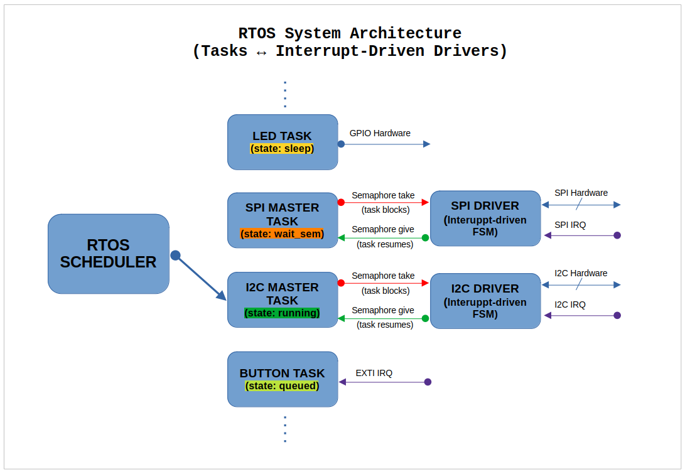
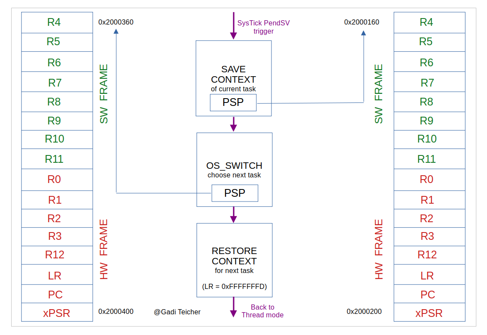
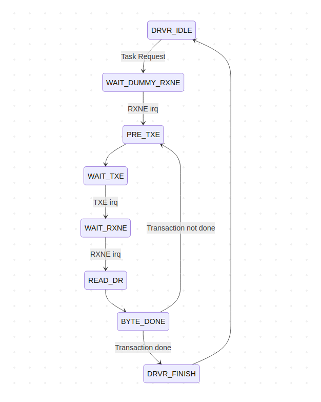

# STM32 Bare-Metal RTOS (From Scratch)

> *Context switching is an identity swap performed right under the CPU’s nose.*

## Overview

A **from-scratch bare-metal RTOS kernel** running on **STM32 NUCLEO-F446RE (Cortex-M4)**.

This project explores how a Cortex-M behaves at runtime:  
manual scheduling, context switching, stack orchestration, and interrupt-driven execution —  
**without FreeRTOS, CMSIS-OS, or external abstractions.**

The focus is on understanding the system **from the exception level down to the stack frame**.

For architecture diagrams and FSM visualizations: [Documents](Documents/).

---

## Kernel Highlights

- Pure bare-metal implementation  
- Manual context switching via **PendSV**
- Explicit **PSP / MSP separation**
- Handcrafted **initial stack frames (synthetic exception frames)**
- Deterministic scheduler behavior
- Debugger-driven, hardware-first development

---

### RTOS Core
- TIM2 as system tick (1 kHz time base)
- SVC used for controlled first task start
- PendSV as the only context switching mechanism
- Static TCB array with explicit stack ownership per task

### Tasks
- LED task (visible execution)
- Button task (EXTI-driven + debounce handling)
- **SPI task (loopback validation, high-rate transactions)**
- I2C Master task (write-only)
- Idle task (WFI-based)

---

## Context Switching (Cortex-M Deep Dive)

The system performs manual context switching using PendSV,  
with explicit control over PSP and exception stack frames.

- Hardware-stacked registers: **R0–R3, R12, LR, PC, xPSR**
- Software-saved registers: **R4–R11**
- Tasks initialized via **synthetic exception frames**
- PendSV runs at lowest priority to ensure safe preemption

> *Context switching is a chain — if the first task is broken, the next one never starts.*

---

## Scheduling & Synchronization

- Priority-based preemptive scheduling  
- Fair round-robin within equal priority levels  
- Binary Semaphores used for signaling ISR-to-task signaling and driver completion events

**Lightweight stub tasks are used to validate scheduling behavior under different priorities.**

---

## Interrupt-Driven SPI (Primary Workload)

The SPI driver is implemented as an FSM progressing on TXE/RXNE events.

The system is validated using a high-rate SPI workload in loopback (MOSI → MISO),  
stressing scheduling and exposing system limits.

Observed effects include interrupt storms, scheduler starvation,  
and sensitivity to interrupt priority configuration.

### Dual-FSM Architecture

The design separates responsibilities between two state machines:

- **Task-level FSM**  
  Defines the transaction.  
  Prepares data and blocks under the scheduler.

- **Driver/ISR-level FSM**  
  Executes the transaction on the hardware lines.  
  Advances tx/rx and signals completion.

This separation decouples scheduling from hardware execution while preserving timing control.

> *On microcontrollers, parallelism is an art.*

---

## Interrupt-Driven I2C Master (Write-Only)

As an additional validation path, the kernel includes an  
**ISR-driven I2C Master FSM**.

- Task prepares transaction parameters
- ISR advances strictly on hardware events (**SB / ADDR / TXE / BTF**)

---

## Debugging Focus

- HardFault root-cause analysis (stack + exception return)
- Stack alignment and corruption tracking  
- PSP/MSP transition correctness under interrupt load  
- Interrupt priority tuning and storm analysis  

The goal is not just to make it run — but to understand **why it runs, and when it breaks.**

---

## Hardware

- STM32 NUCLEO-F446RE  
- TIM2 scheduler tick  
- GPIO + EXTI  
- SPI2  
- I2C1  

---

## Status

Actively evolving.  
Features are added only after full architectural validation.

